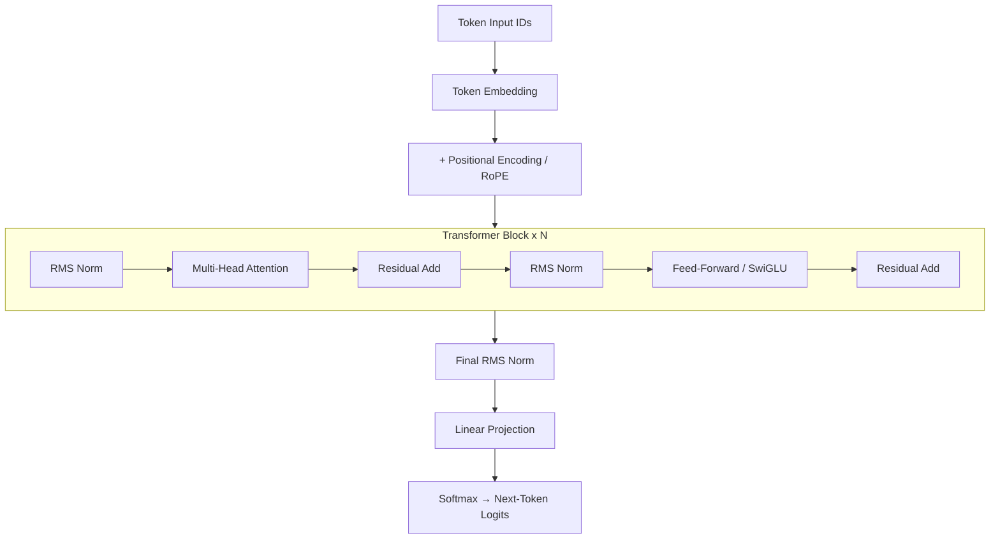

# LLM From Scratch

Building and training a large language model from the ground up using PyTorch — covering every layer of the stack: architecture, pre-training, fine-tuning, and alignment.

---

## Project Phases

```
Phase 1 — Transformer Architecture   →  Build every component by hand
Phase 2 — Pre-Training               →  Train on raw text corpora
Phase 3 — Fine-Tuning & Scaling      →  SFT, LoRA, QLoRA, scaling laws
Phase 4 — Alignment                  →  RLHF, PPO, DPO
```

---

## Architecture Overview



Key design choices (all implemented from scratch):

| Component | Choice | Why |
|---|---|---|
| Positional Encoding | RoPE | Better length generalisation, used by LLaMA/Mistral |
| Normalization | RMSNorm (pre-norm) | More stable than LayerNorm; avoids mean subtraction |
| Activation | SwiGLU | Higher throughput than ReLU/GeLU; used by PaLM, LLaMA |
| Attention | Grouped Query Attention (GQA) | Reduces KV-cache memory vs. MHA |
| Tokenizer | BPE (via `tokenizers`) | Byte-level, language-agnostic |

---

## Project Structure

```
LLM/
├── README.md
├── requirements.txt
├── main.py                         # Entry point (train / eval / generate)
│
├── configs/                        # Hydra / OmegaConf YAML configs
│   ├── model/
│   │   ├── small.yaml              # ~125 M param config
│   │   └── medium.yaml             # ~350 M param config
│   ├── training/
│   │   ├── pretrain.yaml
│   │   └── finetune.yaml
│   └── alignment/
│       ├── sft.yaml
│       └── dpo.yaml
│
├── src/
│   ├── model/                      # Phase 1 — Architecture
│   │   ├── __init__.py
│   │   ├── attention.py            # Multi-Head / GQA + RoPE
│   │   ├── feedforward.py          # SwiGLU FFN
│   │   ├── normalization.py        # RMSNorm
│   │   ├── transformer_block.py    # Single decoder block
│   │   └── gpt.py                  # Full model: embedding → blocks → head
│   │
│   ├── tokenizer/                  # Phase 1 — Tokenization
│   │   ├── __init__.py
│   │   ├── bpe_tokenizer.py        # Train BPE from scratch with `tokenizers`
│   │   └── utils.py
│   │
│   ├── data/                       # Phase 2 — Data Pipeline
│   │   ├── __init__.py
│   │   ├── dataset.py              # IterableDataset over raw text
│   │   ├── collator.py             # Pad / pack sequences
│   │   └── preprocessing.py       # Cleaning, deduplication
│   │
│   ├── training/                   # Phase 2 & 3 — Training Loop
│   │   ├── __init__.py
│   │   ├── trainer.py              # Custom training loop with Accelerate
│   │   ├── scheduler.py            # Cosine LR + warmup
│   │   ├── optimizer.py            # AdamW with weight decay grouping
│   │   └── checkpointing.py       # Save / resume checkpoints
│   │
│   ├── finetuning/                 # Phase 3 — Fine-Tuning
│   │   ├── __init__.py
│   │   ├── sft.py                  # Supervised Fine-Tuning
│   │   ├── lora.py                 # LoRA layers (manual implementation)
│   │   └── qlora.py                # QLoRA: 4-bit base + LoRA adapters
│   │
│   └── alignment/                  # Phase 4 — Alignment
│       ├── __init__.py
│       ├── reward_model.py         # Reward model (LM head → scalar)
│       ├── ppo_trainer.py          # PPO loop with `trl`
│       └── dpo_trainer.py          # Direct Preference Optimisation
│
├── scripts/
│   ├── train_tokenizer.py          # Train BPE tokenizer on a corpus
│   ├── pretrain.py                 # Launch pre-training run
│   ├── finetune.py                 # Launch SFT / LoRA run
│   └── align.py                    # Launch PPO or DPO run
│
├── notebooks/
│   ├── 01_attention_visualisation.ipynb
│   ├── 02_tokenizer_analysis.ipynb
│   └── 03_scaling_laws.ipynb
│
└── tests/
    ├── test_attention.py
    ├── test_model.py
    ├── test_tokenizer.py
    └── test_training_step.py
```

---

## Installation

### 1. Prerequisites

- Python >= 3.10
- CUDA-capable GPU (recommended; CPU works for experimentation)
- [CUDA Toolkit](https://developer.nvidia.com/cuda-downloads) matching your PyTorch build

### 2. Create a virtual environment

```bash
python -m venv .venv

# Windows
.venv\Scripts\activate

# macOS / Linux
source .venv/bin/activate
```

### 3. Install PyTorch (CUDA)

Install PyTorch separately first so you can pick the right CUDA version.
PyTorch 2.12 (current stable) does **not** ship a `cu131` wheel — there is no
exact match for CUDA 13.1. Use `cu130` instead: CUDA wheels are backward-
compatible, so a 13.0-compiled wheel runs fine on a 13.1 driver.

```bash
# CUDA 13.x (13.0 / 13.1 / 13.2 driver) — recommended
pip install torch torchvision torchaudio --index-url https://download.pytorch.org/whl/cu130

# CUDA 12.6 (legacy — Maxwell / Pascal / Volta GPUs)
pip install torch torchvision torchaudio --index-url https://download.pytorch.org/whl/cu126

# CPU only
pip install torch torchvision torchaudio --index-url https://download.pytorch.org/whl/cpu
```

> **CUDA 13.x note:** `cu130` supports Turing (RTX 20xx) and newer only.
> If you have a Pascal (GTX 10xx) or Volta (V100) GPU, use `cu126` instead.

### 4. Install remaining dependencies

```bash
pip install -r requirements.txt
```

### 5. Verify installation

```bash
python - <<'EOF'
import torch
print(f"PyTorch   : {torch.__version__}")
print(f"CUDA      : {torch.cuda.is_available()}")
if torch.cuda.is_available():
    print(f"GPU       : {torch.cuda.get_device_name(0)}")
    print(f"VRAM      : {torch.cuda.get_device_properties(0).total_memory / 1e9:.1f} GB")
EOF
```

---

## Phase Summaries

### Phase 1 — Transformer Architecture

Hand-roll every component without using `nn.TransformerEncoder` or HuggingFace model weights:

- **Tokenizer** — BPE trained on a small corpus
- **Embeddings** — Token + RoPE positional encodings
- **Attention** — Scaled dot-product, causal mask, multi-head, GQA
- **FFN** — SwiGLU two-gate design
- **Normalization** — RMSNorm applied pre-block (pre-LN style)
- **Full model** — Stacked decoder-only blocks with tied input/output embeddings

### Phase 2 — Pre-Training

- **Dataset** — [TinyStories](https://huggingface.co/datasets/roneneldan/TinyStories) or [OpenWebText](https://huggingface.co/datasets/Skylion007/openwebtext) (streamed)
- **Objective** — Causal language modelling (next-token prediction)
- **Optimizer** — AdamW with cosine LR schedule and linear warmup
- **Infrastructure** — Mixed precision (bf16), gradient clipping, Accelerate multi-GPU
- **Monitoring** — W&B loss curves, gradient norms, token throughput

### Phase 3 — Fine-Tuning & Scaling

- **SFT** — Supervised fine-tuning on instruction/response pairs
- **LoRA** — Low-rank adapter layers injected into Q/V projections
- **QLoRA** — 4-bit quantised base model + LoRA (fits larger models on consumer GPUs)
- **Scaling laws** — Chinchilla-optimal compute/data experiments

### Phase 4 — Alignment

- **Reward Model** — Trained on preference pairs (chosen vs. rejected)
- **PPO** — Proximal Policy Optimisation with KL penalty against SFT reference
- **DPO** — Direct Preference Optimisation (no separate RM, simpler pipeline)

---

## Key References

| Paper | What it covers |
|---|---|
| [Attention Is All You Need](https://arxiv.org/abs/1706.03762) | Original Transformer |
| [RoFormer](https://arxiv.org/abs/2104.09864) | Rotary Position Embedding (RoPE) |
| [LLaMA](https://arxiv.org/abs/2302.13971) | RMSNorm, SwiGLU, RoPE in practice |
| [LoRA](https://arxiv.org/abs/2106.09685) | Low-Rank Adaptation |
| [QLoRA](https://arxiv.org/abs/2305.14314) | 4-bit quantised fine-tuning |
| [Chinchilla](https://arxiv.org/abs/2203.15556) | Compute-optimal scaling laws |
| [InstructGPT / RLHF](https://arxiv.org/abs/2203.02155) | PPO-based alignment |
| [DPO](https://arxiv.org/abs/2305.18290) | Direct Preference Optimisation |
| [GQA](https://arxiv.org/abs/2305.13245) | Grouped Query Attention |
